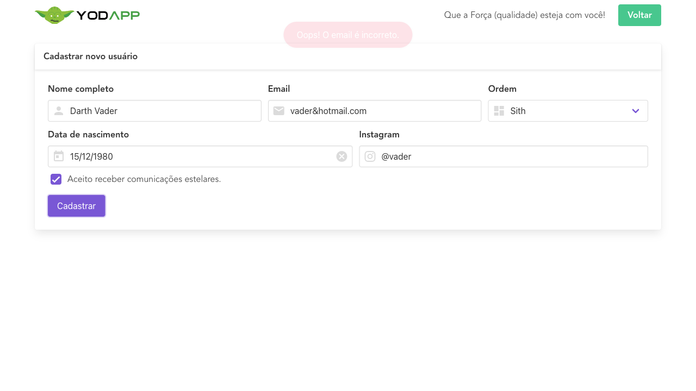

# 1. Summary
- [1. Summary](#1-summary)
- [2. Notes](#2-notes)
  - [2.1. Structure](#21-structure)
    - [2.1.1. Global variables (BEST PRACTICE)](#211-global-variables-best-practice)
  - [2.2. Toasters - dealing with toasters](#22-toasters---dealing-with-toasters)
    - [2.2.1. Successful validation](#221-successful-validation)
    - [2.2.2. Invalid email validation](#222-invalid-email-validation)
    - [2.2.3. Refactoring validation strategy](#223-refactoring-validation-strategy)
  - [2.3. Locators - Finding elements](#23-locators---finding-elements)
    - [2.3.1. AppActions - Changing elements (BEST PRACTICE)](#231-appactions---changing-elements-best-practice)
    - [2.3.2. Super variables (BEST PRACTICE)](#232-super-variables-best-practice)
    - [2.3.3. Externalizing dictionary](#233-externalizing-dictionary)
  - [2.4. Hooks and Encapsulation (BEST PRACTICE)](#24-hooks-and-encapsulation-best-practice)
  - [2.5. Tags](#25-tags)
  - [2.6. base.robot](#26-baserobot)
  - [2.7. register.robot](#27-registerrobot)
    - [2.7.1. Validating character creation](#271-validating-character-creation)
  - [2.8. Datepicker](#28-datepicker)
  - [2.9. Split Strings](#29-split-strings)
  - [2.10. Organizing Robot files](#210-organizing-robot-files)
  - [2.11. Radio button and Checkbox](#211-radio-button-and-checkbox)
- [3. Practicing](#3-practicing)
- [4. Deploying App to CLoud](#4-deploying-app-to-cloud)
- [5. Keywords](#5-keywords)
- [6. Terminal commands](#6-terminal-commands)
- [7. Devtools regular expressions](#7-devtools-regular-expressions)
- [8. Fly Cloud commands](#8-fly-cloud-commands)
- [9. Important links](#9-important-links)

---
# 2. Notes
Automation testing with Robot Framework

Robot Framework is an automation testing tool used to reduce manual repetitive testing.

---
## 2.1. Structure
To create a robot file you first need to create de file structure:

* Here we enter all information needed to run the test;

```
*** Settings ***

Documentation    Test suit to verify with app is online

Library    Browser
```

* Then you define all your test cases with all their desired running steps;


```
*** Test Cases ***

Yodapp should be online
    
New Browser    chromium    headless=False    slowMo=00:00:01 
New Page    https://yodapp.vercel.app

Get Title    equal    Yodapp | QAninja

Take Screenshot
```
Following BDD techniques from Gherking all Test Cases we'll consider all those 3 keypoints:

* <u>Preparation</u> - here you'll set all your conditions
**<p>For example:</p>**
```
# Given that the resistration form was acessed
    # Selecting the button to move to the register page
    Click    text=Novo

    # Checkpoint (confirming that we're inside the register page)
    Wait For Elements State    css=.card-header-title >> text=Cadastrar novo usuário
    ...    visible    5

```

* <u>Action</u> - here's where you'll define what actions should happen for the previous conditions, data should be entered, ...
**<p>For example:</p>**
```
# When filling in those forms with Master Yoda's data
    # Filling in the input fields
    Fill Text    css=input[placeholder^="Nome"]    Mestre Yoda
    Fill Text    css=input[placeholder="Email"]    yoda@gmail.com

    # Entering a option in the selection field
    Select Options By    css=.ordem select    value    1 

    # Selecting the radio buttom
    Click    xpath=//input[@value="Cavaleiro Jedi"]/..//span[@class="check"]
    
    # Entering datepicker information
    Select Birth Date    fevereiro    1970    20
    
    # Filling in the input fields, moved down here to follow the fields entering order
    Fill Text    id=insta    @yoda   

    # Selecting the checkbox
    Click    xpath=//input[@name="comunications"]/../span[@class="check"]

# And submit this form
    # Selecting the submition button
    Click    css=button >> text="Cadastrar"
```

* <u>Result</u> - here's where the results of all defined actions will be shown
**<p>For example:</p>**
```
# Then I should see the success message
    # Checkpoint (validating toaster)
    Wait For Elements State    text="Usuário cadastrado com sucesso!"    visible    5     
```

**OBS.:** Using only the text from the toaster as selector isn't the better option. To create a better selector follow the "dealing with toarters steps" down below.

### 2.1.1. Global variables (BEST PRACTICE)
Global variables are commonly written in caps lock in order to be easly tracked. For example:

URL being defined as a global variable assuming name ${BASE_URL}
```
*** Keywords ***
${BASE_URL}    https://yodapp-testing.vercel.app

Start Session
    New Browser    chromium       headless=False    slowMo=00:00:00 
    New Page       ${BASE_URL}

End Session
    Take Screenshot
```

---
## 2.2. Toasters - dealing with toasters
Toasters are temporary messages displayed inside the page after an action or validation. As they're temporary it's hard to inspect them and sometimes it makes impossible to find those elements while running the application.

### 2.2.1. Successful validation
To deal with those elements use the following steps:
1. Add a break/sleep while getting the html code used for this page and show this code;
```
Sleep       1
${html}     Get Page Source
Log         ${html}
```

2. Create a temporary file to copy/paste this html code, for example: temp.html;
**OBS.:** you'll need to run the test first in order to show the log

3. Find the displayed text/message/toast element inside the previous file containing the html code;


4. Create the necessary selectors in order to find this element inside the page.
```
Wait For Elements State     css=.toast div >> text="Usuário cadastrado com sucesso!"    visible     5
```

### 2.2.2. Invalid email validation
Considering that the only change between the successful and failed validation is the displayed message from the toaster, we'll use the same elements, just copy and pasting from the successful validation scenario, and then change just the necessary elements.

This is one way of doing it, but as the developer can change these elements in the future we'll need to change all those elements in order for the test case to work. One wai of improving it and also follow a best practice is to add encapsulation for those repeated elements.

By using encapsulation it's possible to change all repeated elements all together with only one change.

### 2.2.3. Refactoring validation strategy
The way we're validating the toast now makes impossible to see the actual toast message because of the 5 seconds timeout. Considering that the toaster is displayed for less then 5 seconds it won't be showing when the print screen is taken if the test fails because of text discrepancies.



A better way to validate this toaster is to:
1. First find the toaster element

```
Wait For Elements State    css=.toast div    visible    5    
```

2. Validate the text by comparisson

```
Get Text                   css=.toast div    equal      ${expected_message}
```

Now we're doind two separate steps os validation:
- first validating that the toaster is being displayed
- then verifying if the displayed message is correct

**OBS.:** It will still fail the test but now we can 1-see the toaster message in the print screen, and 2-get a more detailed error message making it easier to understand what is happening and how to fix.

An extra step to make the code even better by defining a variable to englobe the repeated locators (css=.toast div):

```
Toaster Message Should Be
    [Arguments]    ${expected_message}

# Then I should see the success message
    # Accessing html code source to create a proper locator for the toaster
    # Sleep    1
    # ${html}    Get Page Source
    # Log    ${html}

    ${element}  Set Variable    css=.toast div 

    # Checkpoint (validating toaster)
    Wait For Elements State    ${element}    visible    5                      
    Get Text                   ${element}    equal      ${expected_message}
```

**IMPORTANT** 
<p>*** Variables *** should only be used for global variables. In this case we're only using the Set Variable locally to one specific test case so we shouldn't use it inside the global variables!</p>

---
## 2.3. Locators - Finding elements

Locators are used to find elements inside the page

Priority order to consider while dealing with forms/inputs: id > name > placeholder

**OBS.:** placeholder and name variables are exclusive for inputs, select buttons and text areas, also they can be used for checkboxes and radio buttons. But they'll never be present in divs, tables and buttons.

```
css=.navbar-item
```

In robot framework it's possible to combine different selector types in order to find a specific element.

**Ex.:** using css element selector and text locator as well
```
css=.navbar-item >> text=Que a Força (qualidade) esteja com você!
```

It is recommended to prioritize using CSS selector first and then using XPath only if there's no other option.

### 2.3.1. AppActions - Changing elements (BEST PRACTICE)

Elements properties can change frequently making old selectors invalid for new versions of the application. We can easily solve this by updating the selectors to more up to date properties, but it needs to be done individually for each of the old invalid elements and this can be impracticable for projects with hundreds of test cases that use those same elements.

A best practice to solve the problem of changed elements is using AppActions.
**Example:** register flow:
1. Define scenarios which are part of the registration;
2. Look for duplicates in those scenarios;
3. Create a keyword to "encapsulate" all those scenarios into the same place;
4. Add this keyword to your individual test cases.

Filling the inputs:
```
Fill User Form
    [Arguments]    ${name}    ${email}    ${ordem}

# When filling in those forms with Master Yoda's data
    # Filling in the input fields
    Fill Text    css=input[placeholder^="Nome"]    ${name}
    Fill Text    css=input[placeholder="Email"]    ${email}
```

Radio button and checkbox selection are either occasional and/or optional so we'll encapsulating them separatelly in order to use just when needed.

Selecting radio buttons:
```
# Selecting radio buttons dinamically
Select Jedi
    [Arguments] ${tpjedi}

    # Selecting the radio buttom
    Click    xpath=//input[@value="${tpjedi}"]/..//span[@class="check"]
```

Selecting checkboxes
```
# Selecting checkbox dinamically
Check Accept comunications
    # Selecting the checkbox
    Click    xpath=//input[@name="comunications"]/../span[@class="check"]
```
**OBS.:** By doing this you'll only need to change the keyword variables and it'll be applied to all your test cases. This means that you can use the same code while changing the test mass by using defined variables.

### 2.3.2. Super variables (BEST PRACTICE)
Some keyworks used for encapsulation will need a lot of different arguments. For example:

Filling forms with different informations:
```
Fill User Form                Mestre Yoda                         yoda@jedi.com    Jedi    fevereiro-1970-20    @yoda
```

One way to deal with this is by using a super variable:
1. First we'll create a dictionary that will contain all our data mass, setting all our arguments inside of it.

```
&{user}     Create Dictionary
...         name=Mestre Yoda
...         email=yoda@jedi.com
...         ordem=Jedi
...         tpjedi=Cavaleiro Jedi
...         bdate=fevereiro-1970-20
...         instagram=@yoda
```
**OBS.:** This dictionary can assume all kinds of values even lists can be defined here. Note that you need to use "&" in order for robot to understand that this is going to be a dictionary.

2. Change all the arguments for the defined (Super variable) name - &{user}

```
Fill User Form                ${user}
```
**OBS.:** Here we're now going to use "$" to define user as a variable.

3. Change your actions arguments is needed as well. Here we'll also need to take an addional step informing the dictionary and the desired value as well. For example:

```
# Filling user forms dinamically
Fill User Form
    [Arguments]    ${user}

# When filling in those forms with Master Yoda's data
    # Filling in the input fields
    Fill Text    css=input[name="nome"]     ${user}[name]
    Fill Text    css=input[name="email"]    ${user}[email]
```

Here we've created our dictionary with all our testing data mass limited to only those expecific test cases where dictionary is inserted. There's a way of making it even better by externalizing all these testing data mass to other files as well.

### 2.3.3. Externalizing dictionary
To make it possible we'll use a external file following the steps:
1. Create a new folder (factories) to store all our dictionaries;
2. Create a new file that will contain our super variables and all testing data mass (users.py);
3. Define a method with a variable that will contain all testing data mass inside and make the file return those values:

```py
# Defining a method
def factory_yoda():

    # putting all test data mass inside a variable
    user = {
        "name": "Mestre Yoda",
        "email": "yoda@jedi.com",
        "ordem": "Jedi",
        "tpjedi": "Caveleiro Jedi",
        "bdate": "fevereiro-1970-20",
        "instagram": "@yoda"
    }

    # returning variable user value
    return  user
```

4. Import this file as a library inside the test case file;
5. Change the old dictionary

```
Should register a new character
    [Tags]    happy

    &{user}     Create Dictionary
    ...         name=Mestre Yoda
    ...         email=yoda@jedi.com
    ...         ordem=Jedi
    ...         tpjedi=Cavaleiro Jedi
    ...         bdate=fevereiro-1970-20
    ...         instagram=@yoda
```

For the new one (now coded in python)

```
Should register a new character
    [Tags]    happy

    &{user}     Factory Yoda
```
**OBS.:** Now all test data mass is integrated to an external file coded in python (users.py) and it's possible to call this new dictionary for whatever file and folder you want to as long as the lib where the information should come from is informed.

```
Library     ${EXECDIR}/resources/factories/user.py
```

6. We don't need to call the keywork Create a Dictionary inside robot so now we'll also need to change all our super variables "&(user)" for normal variables "$(user)".

---
## 2.4. Hooks and Encapsulation (BEST PRACTICE)

Personalized keywords can be defined inside robot to decrease repeated code

To use this function first you need to create the keywords:

```
*** Keywords ***
Start Sessions
    New Browser    chromium    headless=False    slowMo=00:00:01 
    New Page    https://yodapp.vercel.app

End Section
    Take Screenshot
```

And then define them inside *** Setting *** tab to define where they'll be calledduring a defined step of the test:

```
*** Settings ***

Test Setup  Start Session
Test Teardown   End Session
```

These keywords can be reused by putting it inside a new file that will contain only those global functions (in this case the file _base.robot_)

---
## 2.5. Tags
Tags are used in order to run specific tagged test cases by calling its defined tag. For example:
```
*** Test Cases ***
Should register a new character
    [Tags]    happy
```

```
Invalid Email
    [Tags]    inv_email
```

The usage of tags is very important and useful for critical cases, smoke testing and regression. You can tag the critical test cases and then run these most important cases all together first.

---
## 2.6. base.robot

Here we're going to define all primary characteristics, and then we're going to import those functions to all the other files and test cases. This is usefull to reduce repetitive elements.

For example:

Defining a library from where the functions will come and them defining what should be done while start and end session should do when called during the test cases.

```
*** Settings ***
Documentation    This isn't a test suite, but the primary file of the project

Library    Browser

*** Keywords ***
Start Session
    New Browser    chromium    headless=True   slowMo=00:00:01 
    New Page    https://yodapp.vercel.app

End Session
    Take Screenshot
```

By doing this we don't need to add those same keywords again individually into all the other files, instead we just need to reference the file that contains this information (in this case the file base.robot) inside the files that will use it.

```
Resource    base.robot
```

---
## 2.7. register.robot

Everytime you change to a new page it's nice to define a checkpoint to make sure you're in the right path

```
# Checkpoint (confirming that we're inside the register's page)
Wait For Elements State    css=.card-header-title >> text=Cadastrar novo usuário
...    visible    5
```

* If a specific element don't have any other properties outside for the element itself it's possible to use the father element
- Example:
    - The select element have no additional properties for selection so we'll look for the father elements (div data-v-e59530da class="control ordem is-expanded has-icons-left") for a better element selection.


**OBS.:** span element only have the class property so it isn't the better option as well.

* How to use the father element to increase specificity:
    1. Find a father element - div data-v-e59530da class="control ordem is-expanded has-icons-left"
    2. Select this element - .ordem
    3. Inform the specific desired element inside of it - .ordem select

Now you have a better selector, and need to inform which option to select:

* index - the first option is by using the property index and giving the item position stating from 0 to the first one
```
index   0
```
* label - when present you can also use the property label giving it's defined label
* value - here you give the direct defined item value 
```
value   1
```
* text - here you give the direct defined item text
```
text    Jedi
```

**OBS.:** consider prioritizing the usage of value and text properties.

### 2.7.1. Validating character creation
In order to make sure that register is actually working we'll now define a new testing step to verify the character creation. To do this we'll need to:

1. Return to the home page, where characters list is displayed;

```
    Go To    ${BASE_URL}

    # Checkpoint (confirming that we're inside the home page)
    Wait For Elements State    css=.carousel    visible    5
```

2. Validating character creation;

```
User Should Be Visible
    [Arguments]    ${user}

    Wait For Elements State    xpath=//td[contains(text(),"${user}[email]")]/..    visible    5
```

**OBS.:** Tables don't have any properties to work with so we need to work with the columns text as selectors.

3. Adding a checkpoint to validade other informations for the created character.

```
    # Adding a checkpoint to validate other elements as well
    Wait For Elements State    ${element}    visible     5
    Get Text                   ${element}    contains    ${user}[name]
    Get Text                   ${element}    contains    ${user}[instagram]
```

---
## 2.8. Datepicker

For the date picker we'll need four steps:

1. Click field
2. Select month
3. Select year
4. Select day

**OBS.:** this datepicker don't accept you to enter any information inside of it by typing so the function Fill Text won't work.

Again the month dropdown element don't have any useful property so we're going to use it's father element header class="datepicker-header". In this case selecting it with Xpath instead of CSS selector.

To start the Xpath first we use // and then the following path, for example:

```
(//header[@class="datepicker-header"]//select)[1]
```

**OBS.:** (xpath)[1] is used to make the selector consider the first xpath found with those properties. This can be used to filter elements with the same name per order of apperance, starting with 1, 2, 3 and so on

---
## 2.9. Split Strings

Initially we defined a keyword to select the birth date inside the datepicker using 3 isolated arguments (month, year, and day). 
```
Select Birth Date
    # Defining entry arguments whom will be used inside the function instead of having to manually add each one of them
    [Arguments]    ${month}    ${year}    ${day} 
```

```
# Entering datepicker information
    Select Birth Date    dezembro    1980    15
```

We can improve these splitted strings making them part of the same argument following the steps below:

First we'll change your inputs format:

```
# Entering datepicker information
    Select Birth Date    dezembro-1980-15
```

Then we're going to change your argumets and add a split string separator

```
    [Arguments]    ${text_date}

    @{date}    Split String    ${text_date}    -
```

Here where saying for robot to expect a date text and split then into individual strings based on the given separator, in this case defined as "-". Then we're savings it inside a list using @{date}.

In the end we'll add this list component with an indicator so the robot can undestand where to use each argument:

```
Select Birth Date
    # Defining entry arguments whom will be used inside the function instead of having to manually add each one of them
    [Arguments]    ${text_date}

    @{date}    Split String    ${text_date}    -

    Click    css=input[placeholder="Data de nascimento"]

    Select Options By    xpath=(//header[@class="datepicker-header"]//select)[1]
    ...    text    ${date}[0]

    Select Options By    xpath=(//header[@class="datepicker-header"]//select)[2]
    ...    value    ${date}[1]

    Click    xpath=//a[contains(@class, "datepicker-cell")]//span[text()="${date}[2]"
```

**OBS.:** This is important to make the code more dinamid while evolving to more complex scenarios!

If needed you can import the String library inside the base.robot file in order to use those functions.

---
## 2.10. Organizing Robot files

Here we're organizing our files, separating them into resources (those containing configurational information - libs, keywords, ...) and tests (those containing our test cases and scenarios).

While changing files' path note that our test cases can probably break, this happens because the source files cannot be found anymore. In order to fix this we'll need to change the destination to the new actual path:

Old path:
```
Resource    base.robot
```

New fixed path:
```
${EXECDIR}/resources/base.robot
```

**OBS.:** without using the Robot Framework Intellisense extension ${EXECDIR} argument don't work so we'll need to use another way to identify the path. For example, using the hole path: /Users/andre/Documents/QA Academy/Gravidade Zero/yodapp/resources/base.robot

---
## 2.11. Radio button and Checkbox

While trying to select or find Radio button elements it's important to keep in mind if the button is visible or hidded. Some times this elements are set as hidden in order to apply style to it. 
* For example:
    - input type="radio" name="tipo-jedi" value="Cavaleiro Jedi" is being hidded behind the label data-v-e59530da="" class="b-radio radio" although the clicking action is defined in the element span class="check"


To solve this will proceed with the following steps:
1. Look for a possible xpath to replace the CSS selector;
2. Find the element responsible for the click action;
3. Write the xpath that'll lead to it

```
xpath=//input[@value="Cavaleiro Jedi"]/..//span[@class="check"]
```

4. Test and adjust your path until it's unique;
5. Add it to the click function.

```
Click    xpath=//input[@value="Cavaleiro Jedi"]/..//span[@class="check"]
```

**OBS.:** note that you can use ../ to go up some layers inside parent elements and // to go down again.

---
# 3. Practicing

Submitting register information.

There's many options to select this button:

* My response was using xpath to find the button, using only it's tag:
```
xpath=//button
```

It works but isn't the best option to use because there can be added new buttons to the code and it'll broke.

* A better option is to combine selectors using the element tag and also the displayed button text:

```
css=button >> text="Cadastrar"
```

This is a better option because it's format uses more properties, making the element search more specific.

---
# 4. Deploying App to CLoud

Heroku was being used to deploy our app servers, but now we're moving to a free version substitute called Fly that we'll do the same.

Fly Cloud works through code lines only inside Power Shell (on Windows). Terminal will work for macOS.

---
# 5. Keywords

* **_headless_** - receive <u>"true" or "false"</u> to show the page while running the test
* **_slowMoo_** - receice a <u>time - hh:mm:ss</u> to slow down the run
* **_visible_** - consider that the element should be visible
* **_timeout_** - defines the maximum time to find the element 
* **_>>_** - informs combinations of selectors
* **_sleep_** - makes the script sleep/stop for defined time (5 seconds in this case)
* **_wait_** - wait some time until the element is present
* **_Test Setup_** - Used to apply a defined behavior before the test case 
* **_Test Teardown_** - Used to apply a defined behavior after the test case
* **_css=_** - used as css selector to find a css elements
* **_text=_** - used to find defined texts inside elements from css
* **_..._** - make possible to break arguments in different lines inside the same function
* **_index_** - follow a defined ordem (indexation)
* **_click_** - select the defined element
* **_Split String_** - slip arguments into individual strings based on the separator


**OBS.:** using wait instead of sleep is the best practice once the element can be found before 5 seconds, giving you time gains in comparison with the sleep function.

---
# 6. Terminal commands

* **_robot -d ./logs online.robot_** - will tell robot to run the described file and them save the retuned outputs inside a new directory, in this case named logs (./ is used to create the directory inside the actual directory - Yodapp)
* **_robot -d ./logs -i inv_email register.robot_** - here we're informing robot that the tag inv_email is being included inside the running scenarios
* **_robot -d ./logs -e happy register.robot** - here's the opposite of -i which means that the test cases tagged with happy must be excluded from the running scenarios

---
# 7. Devtools regular expressions

* **_.classname_** - search for a class
* **_*_** - used while searching for elements to filter for all the elements that contains this variable instead of those exactly equal to it. 
<br>**<u>Ex.:</u>** 
    - a[href=/new] - here we're looking for an element 'a' that contains a 'href' with the exact content of '/new'
    - a[href*=new] - here we'll look for a element 'a' with a 'href' that contains the argument 'new' inside of it
* **_^_** - filter for all elements that starts with the defined argument

--- 
#  8. Fly Cloud commands
* **_flyctl_** - this is the standard command to call the fly

---
# 9. Important links

* [Course pathway](https://app.qacademy.io/area/produto/item/148964)
* [App used for testing](https://yodapp.vercel.app/)
* [Xpath cheatsheed](https://devhints.io/xpath)
* [Robot Browser Library Guide](https://marketsquare.github.io/robotframework-browser/Browser.html?_gl%3D1%2A15e6l3s%2A_ga%2AMTU1ODkzMjgxMi4xNjcyNzE4Njcy%2A_ga_37GXT4VGQK%2AMTY3MjkzODQyOC41LjEuMTY3MjkzODQ4Ni4wLjAuMA..)
* [Deploy App Servers to Cloud](https://fly.io)
* [QA academy Fly publishing package](https://github.com/weareqacademy/gz-apps) 
<!-- OBS.: no more ambient updating is needed from here -->
